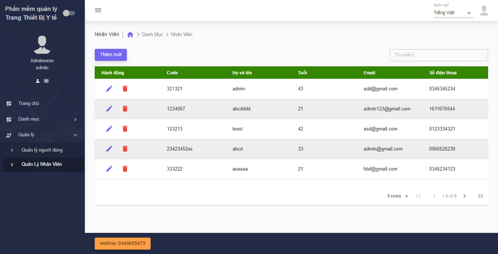
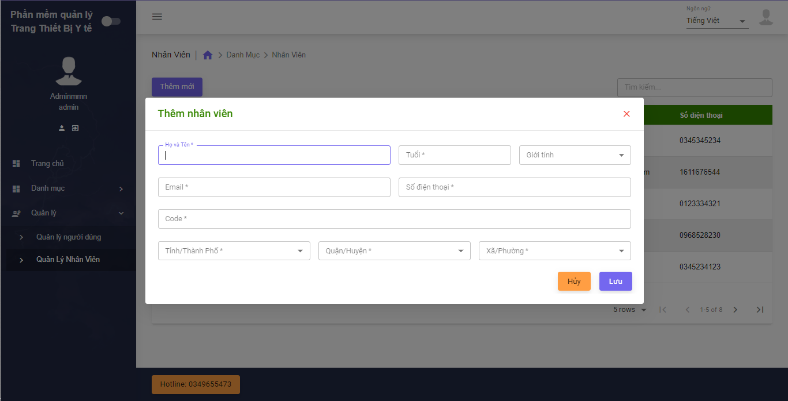

# Phần mềm quản lý trang thiết bị y tế - React App.
Tôi xây dựng dự án này để học ReactJS cơ bản, tạo ứng dụng Single-page application và biết cách hoạt động của React. Project là một ứng dụng App đơn giản để quản lý thiết bị y tế, quản lý nhân sự, ... 

# Cài đặt.
1. Sao chép lại dự án: git clone https://github.com/hdCanh2000/Thuctap.git
2. Trong thư mục dự án, bạn có thể chạy: yarn install để cài đặt node module và tất cả các packages.
3. Chạy dự án:  3.1. cd client.
                3.2. yarn start.

## Screenshot.

## Chức năng.
1. Hiển thị thông tin nhân viên.

2. Thêm, sửa, xóa nhân viên.

3. Tìm kiếm nhân viên.